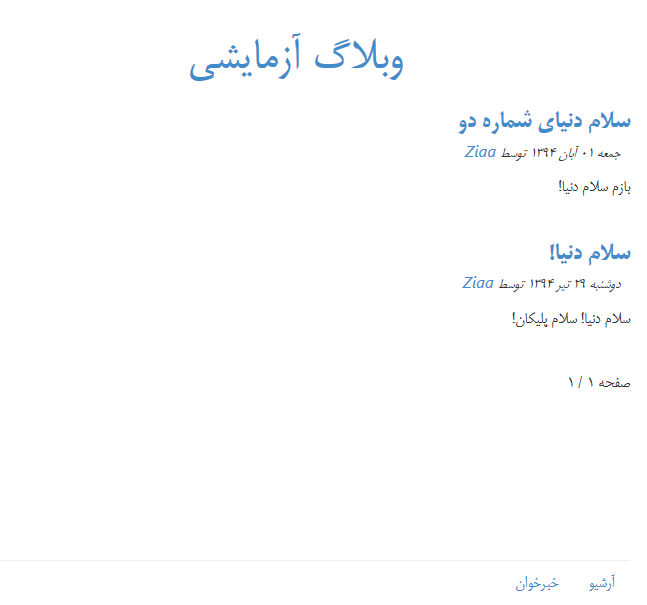

# Pelican-RTL-theme
This is a [Pelican](http://getpelican.com) (Static Site Generator) theme.
This theme is useful for Persian blogs.



## Installation
1. Choose a location to hold your theme.Here we use `themes` directory
2. Get the theme in any way which is convenient for you. for example:
	* Clone the repository into `themes` directory
	```
	git clone https://github.com/ziaa/Pelican-RTL-theme.git
	```
	* Or add the repository as a submodule in `themes` directory
	```
	git submodule add -b master https://github.com/ziaa/Pelican-RTL-theme.git themes/Pelican-RTL-theme
	```
3. Edit your Pelican `pelicanconf.py` settings file and add the path to the theme
```
THEME = "/path/to/themes/Pelican-RTL-theme"
```

(More information on using Pelican themes
  [+](https://github.com/getpelican/pelican-themes#using-themes)
  [+](http://docs.getpelican.com/en/3.6.0/pelican-themes.html))
## Original theme
This theme Forked from [pelican-sobhe
](https://github.com/sobhe/pelican-sobhe)
